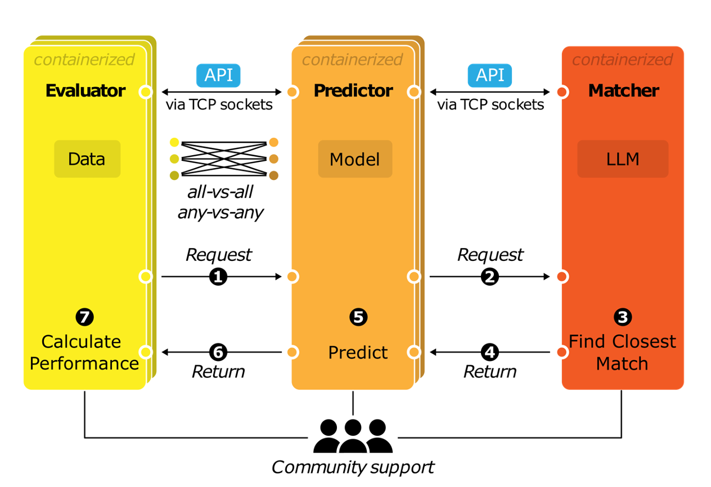
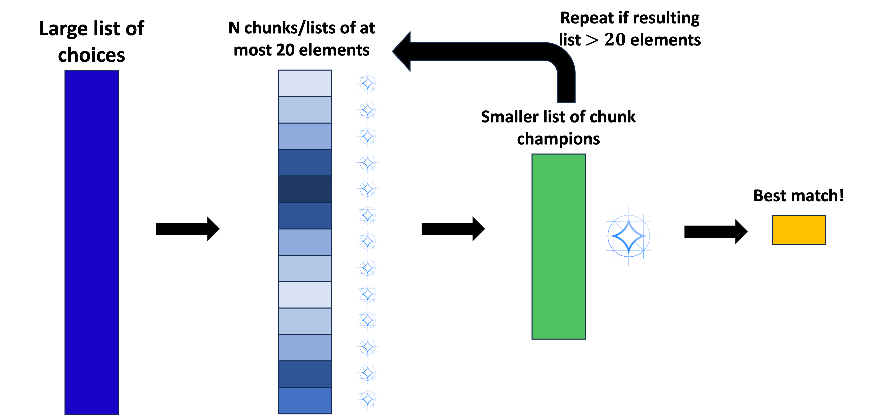

# GAME Matcher Overview

A RESTful standalone service for the Genomic API for Model Evaluation (GAME) that maps free-text biological terms to canonical biological entities using a local LLM.

[Preprint](https://www.biorxiv.org/content/10.1101/2025.07.04.663250v1)

- [GAME Matcher Overview](#game-matcher-overview)
  - [Modules of GAME](#modules-of-game)
  - [System Requirements](#system-requirements)
  - [Usage](#usage)
  - [Automated and Externalized Matching](#automated-and-externalized-matching)
  - [How Queries Work Using a Local Large Language Model (LLM)](#how-queries-work-using-a-local-large-language-model-llm)
    - [**Prompt Engineering**](#prompt-engineering)
    - [**The Recursive Tournament Algorithm**](#the-recursive-tournament-algorithm)
  - [API Reference](#api-reference)
    - [**Endpoint**](#endpoint)
    - [**Matcher Request Payload**](#matcher-request-payload)
    - [**Matcher Response Payload**](#matcher-response-payload)
  - [**Examples of Matcher Performance**](#examples-of-matcher-performance)

<br>

## Modules of GAME

<figure>
    
    <figcaption>All GAME modules are inherently interoperable by communicating via the RESTful GAME API protocol. For each benchmark, the Evaluator requests a prediction from the Predictor, which consults the Matcher to determine the closest task the Predictor can complete. Once the Matcher returns the best match over HTTP, the Predictor will complete its prediction and return it to the Evaluator, which will evaluate performance [Luthra et al. (2025)]. </figcaption>
</figure>

<br>

## System Requirements

To run the Matcher, the host system (e.g. a GPU node) must have:

- **Apptainer (formerly, Singularity):** Easy-to-use standard for running application containers.
- **NVIDIA GPU:** Required for hardware acceleration of the LLM. The `--nv` flag must be used when running the container to enable GPU access.

For a different GPU, like AMD's, check out the [Apptainer GPU Support documentation](https://apptainer.org/docs/user/1.0/gpu.html).

<br>

## Usage

The Matcher container can be downloaded from Zenodo: [[ADD LINK HERE]].

1. **Download the Matcher Container**

    ```bash
    wget -O matcher.sif [LINK]
    ```

2. **Run the Matcher Server**

    This single command starts the container, launches a private Ollama server inside it, and starts the FastAPI server listening for HTTP requests.

    ```bash
    # General Usage:
    # apptainer run --nv --containall <sif_file> <IP_TO_LISTEN_ON> <PORT>

    # Example: Run the matcher, listening on all network interfaces on port 8080
    apptainer run --nv --containall matcher.sif 0.0.0.0 8080
    ```

<br>

## Automated and Externalized Matching

GAME introduces a module called “Matcher”, which automatically maps the Evaluator's requested cell type, measured molecule (TF binding molecule/ protein and histone markers), and species with what a Predictor can provide. The Matcher is designed to perform this task by interpreting the relationship between terms through lexical, syntactic, and semantic matching.

- **Lexical matching:** handles cases of direct string correspondence, such as finding the exact token `A549` within a more descriptive choice like `lung adenocarcinoma cell line: A549`.
- **Syntactic matching:** addresses structural variations and common abbreviations, such as `hek-293` or `SKNSH` to `HEK293` or `SK-N-SH`, respectively.
- **Semantic matching:** uses biological knowledge to connect different terms that refer to the same entity, such as mapping the description `chronic myelogenous leukemia cell line` to its canonical name, `K562`.

<br>

## How Queries Work Using a Local Large Language Model (LLM)

The Matcher bundles the `gemma3:12b` model and all necessary Python dependencies to map fuzzy, free-text user inputs to canonical terms from a controlled vocabulary. It operates as a standalone REST API service, accepting JSON-formatted `POST` requests and returning the best-matched term.

Running Gemma 3 locally means that the model operates directly on the hardware of the system it is deployed in, ensuring data privacy, reducing reliance on external cloud APIs, and lowering operational costs, which are crucial for sensitive or high-throughput workflows. Gemma 3 is also very light-weight and efficient to run on a single GPU or TPU.

### **Prompt Engineering**

The Matcher uses highly specialized prompts for each biological category (`cell_type`, `species`, `binding_{molecule}`). These templates provide the LLM with a persona ("You are an expert..."), strict instructions on reasoning and output format, and few-shot examples to guide its behaviour.

### **The Recursive Tournament Algorithm**

To efficiently match a term against a list of thousands of choices, the Matcher uses a **recursive tournament-style elimination** process:

1. **Divide:** The full list of choices is broken into small chunks (e.g. 20 items per chunk).
2. **Compete:** The LLM finds the single best match within each chunk (the "chunk champion").
3. **Conquer:** The champions from all chunks advance to a championship round. If there are too many champions for a single final round, they compete against each other in new elimination rounds. This process repeats recursively, like a tournament bracket, narrowing the field until a single, overall winner is determined.



This divide-and-conquer method allows the Matcher to scalably and efficiently find the best match from a massive search space.

<br>

## API Reference

The Matcher communicates over HTTP using a standardized REST API.

### **Endpoint**

- **URL:** `/match`
- **Method:** `POST`
- **Content-Type:** `application/json`

### **Matcher Request Payload**

The request payload must be a JSON object conforming to the schema below. The API enforces strict validation logic using the `pydantic` library to ensure data integrity.

**Validation Rules:**

1. **Paired Fields:** If you provide a requested term (e.g. `cell_type_requested`), you must also provide the corresponding list (e.g. `cell_type_list`).

2. **Minimum Requirement:** The request must contain at least one valid category pair to process. Empty requests will be rejected with a `422 Unprocessable Entity` error.

| Key                 | Value type - Required/Optional                   | Description  | Example   |
|--------------|--------------|-------------------------------|--------------|
| `cell_type_requested`                 | `string` - Optional (Paired)                   | The fuzzy input term for the cell type requested by the Evaluator | `"Leukemia cell line"`   |
| `cell_type_list`                 | `array of strings` - Optional (Paired)                   | The list of choices the Predictor can support to match against | `["K562", "A549", "HepG2"]`   |
| `species_requested`                 | `string` - Optional (Paired)                   | The fuzzy input term for the species requested by the Evaluator | `"h_sap"`   |
| `species_list`                 | `array of strings` - Optional (Paired)                   | The list of choices the Predictor can support to match against | `["Homo sapiens", "Mus musculus"]`   |
| `binding_molecule_requested`                 | `string` - Optional (Paired)                   | The fuzzy input term for the binding molecule requested by the Evaluator | `"H3K4_trimethylation"`   |
| `binding_molecule_list`                 | `array of strings` - Optional (Paired)                   | The list of choices the Predictor can support to match against | `["CTCF", "H3K4me3", "POLR2A"]`   |

### **Matcher Response Payload**

The Matcher (server) sends back a JSON payload to the Predictor (client), containing the results of the matching tasks. An `_actual` key will be present for each category pair that was provided in the request.

| Key                 | Value type                   | Description  | Example   |
|--------------|--------------|-------------------------------|--------------|
| `cell_type_actual`                 | `string` or `null`                   | The best match from the `cell_type_list` | `"K562"`   |
| `species_actual`                 | `string` or `null`                   | The best match from the `species_list` | `"Homo sapiens"`   |
| `binding_molecule_actual`                 | `string` or `null`                   | The best match from the `binding_molecule_list` | `"H3K4me3"`   |
| `matcher_version`                 | `string`                   | The version of the Matcher that processed the request. | `"2.0"`   |

<br>

## **Examples of Matcher Performance**

The matcher performs better when more contextual information is provided (e.g. `K562 (erythroid precursors)` is better than just `K562`).

| Cell Type Requested | Matched (Enformer CAGE) | Matched (Borzoi RNA) |
| :--- | :--- | :--- |
| **K562 (erythroid precursors)** | `chronic myelogenous leukemia cell line:K562` | `K562` |
| **HepG2 (hepatocytes)** | `hepatocellular carcinoma cell line: HepG2 ENCODE, biol_` | `HepG2` |
| **SK-N-SH (neuroblastoma)** | `neuroblastoma cell line:NB-1` | `SK-N-SH` |
| **induced pluripotent stem cells (iPS cells; WTC11)** | `Multipotent Cord Blood Unrestricted Somatic Stem Cells,` | `WTC11` |
| **lymphoblasts** | `Burkitt's lymphoma cell line:DAUDI` | `Jurkat, Clone E6-1` |
| **Jurkat T cells** | `acute lymphoblastic leukemia (T-ALL) cell line:Jurkat` | `Jurkat, Clone E6-1` |
| **THP-1 monocytes** | `acute myeloid leukemia (FAB M5) cell line:THP-1 (fresh)` | `CD14-positive monocyte` |
| **lymphoblasts (k562)** | `chronic myelogenous leukemia cell line:K562` | `K562` |
